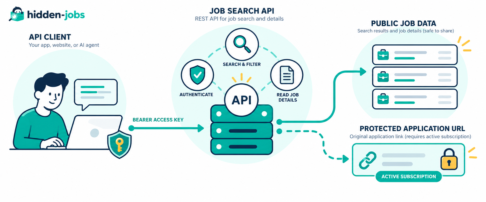
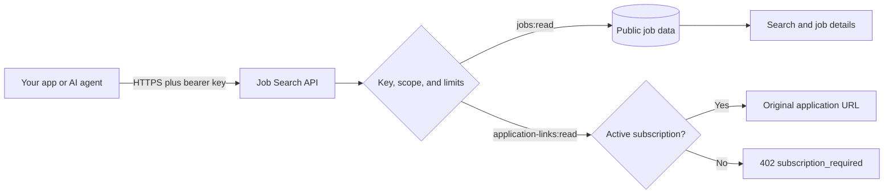

# Job Search API

Find remote technology jobs from your own app, AI agent, or workflow. This public REST API gives developers a clean way to search roles, read full descriptions, compare opportunities, and request the original application link when access allows it.

<p align="center">
  
</p>

[Find remote tech jobs](https://hiddenjobs.dev/) · [Read the API documentation](https://hiddenjobs.dev/api/docs) · [Open the OpenAPI spec](https://api.hiddenjobs.dev/v1/openapi.json)

Looking for an AI-native integration? Use the [Job Search MCP](https://github.com/hiddenjobs/job-search-mcp) instead.

## Hosted API

The hosted API is ready to use:

```text
https://api.hiddenjobs.dev/v1
```

Create an API key in the [developer dashboard](https://hiddenjobs.dev/dashboard/api-keys), keep it in your secret store, and send it as a bearer token on protected requests.

```bash
curl -G "https://api.hiddenjobs.dev/v1/jobs" \
  --data-urlencode "q=typescript" \
  --data-urlencode "remoteLocation=Europe" \
  --data-urlencode "limit=10" \
  -H "Authorization: Bearer hj_live_..."
```

The API is useful for:

- Job boards and career products that need a searchable remote catalog
- AI agents that need structured job data and descriptions
- Internal workflows that match skills, locations, and employment preferences
- Dashboards that monitor job volume, metadata, and API usage

## How it works

1. Your app sends a request to the REST API with a bearer API key
2. The API authenticates the key, scope, pause state, and usage limits
3. Search and detail endpoints return public job data without original source URLs
4. The application-link endpoint performs a second access check before returning the original URL

The API helps a user or product discover and evaluate roles, then retrieve the original application link when the account has the required access. The user completes the application on the employer’s website.



## Endpoints

All paths below are relative to `https://api.hiddenjobs.dev/v1`.

| Method | Path | Access | Purpose |
| --- | --- | --- | --- |
| `GET` | `/health` | Public | Check API availability and version |
| `GET` | `/jobs` | `jobs:read` | Search and filter remote jobs |
| `GET` | `/jobs/{idOrSlug}` | `jobs:read` | Read one job and its full description |
| `POST` | `/jobs/{idOrSlug}/application-link` | `application-links:read` plus active subscription | Return the original application URL |
| `GET` | `/me` | `account:read` | Inspect the current key and limits |
| `GET` | `/me/usage` | `account:read` | Read current usage and limits |

Search and detail responses include `hasApplicationLink` so a client can decide whether to offer an apply action. They intentionally omit `url`, `application_url`, and `source_url`. Only the application-link endpoint can return the original destination.

See the complete [API reference](docs/api-reference.md) or the live [OpenAPI document](https://api.hiddenjobs.dev/v1/openapi.json).

## Quickstart

### 1. Create a key

Create a key in the [API keys dashboard](https://hiddenjobs.dev/dashboard/api-keys). Give it the `jobs:read` scope for search and detail requests. Add `application-links:read` only if your integration needs to open original application destinations.

The full secret is shown once. Treat it like a password and never commit it.

### 2. Search jobs

```bash
curl -G "https://api.hiddenjobs.dev/v1/jobs" \
  --data-urlencode "q=product designer" \
  --data-urlencode "remoteLocation=Worldwide" \
  -H "Authorization: Bearer hj_live_..."
```

A successful response has this shape:

```json
{
  "data": {
    "jobs": [
      {
        "id": "job-uuid",
        "slug": "senior-product-designer",
        "title": "Senior Product Designer",
        "description": "Full job description...",
        "company": "Example Co",
        "location": "Worldwide",
        "skills": ["Figma", "Product design"],
        "hasApplicationLink": true
      }
    ],
    "totalCount": 1,
    "page": 1,
    "limit": 20,
    "hasMore": false
  }
}
```

### 3. Read a job

Use the `id` or `slug` from a search result:

```bash
curl "https://api.hiddenjobs.dev/v1/jobs/senior-product-designer" \
  -H "Authorization: Bearer hj_live_..."
```

### 4. Open the application destination

Only call this endpoint after the user asks to apply:

```bash
curl -X POST \
  "https://api.hiddenjobs.dev/v1/jobs/senior-product-designer/application-link" \
  -H "Authorization: Bearer hj_live_..."
```

The key must have `application-links:read` and its owner must have an active subscription. Otherwise the API returns `402 subscription_required`. Search and job descriptions remain available.

Ready-to-run examples for shell, Node.js, and Python are in [`examples/`](examples/). A small authenticated smoke test is in [`scripts/smoke-test.ts`](scripts/smoke-test.ts).

## API design

### Search parameters

`GET /jobs` accepts `q`, `category`, `employmentType`, `jobType`, `remoteLocation`, `page`, and `limit`.

- `q` accepts keywords, roles, skills, or company names
- `remoteLocation` accepts values such as `Worldwide`, `Europe`, `Spain`, `Germany`, `US`, or `LATAM`
- `page` starts at `1`
- `limit` defaults to `20` and is capped at `50`

Invalid or unsupported filter values fall back to the API default rather than expanding the query beyond the supported catalog.

### Response boundary

The public job object contains searchable information, descriptions, structured metadata, skills, and a boolean application-link indicator. Original URLs are kept out of list and detail responses and are checked again for every gated request.

### Errors and limits

Errors use JSON with an `error` message and, when useful, a stable `code`.

| Status | Code | Meaning |
| --- | --- | --- |
| `401` | `missing`, `invalid`, `revoked`, or `expired` | The bearer key cannot be used |
| `402` | `subscription_required` | An active subscription is required for the original URL |
| `403` | `insufficient_scope` or `paused` | The key cannot perform the operation |
| `404` | — | The route, job, or application link was not found |
| `429` | `rate_limit` or `monthly_limit` | A configured usage limit was reached |
| `503` | `backend_error` | Authentication storage is temporarily unavailable |

Respect `Retry-After` on `429` responses. API keys are managed from the dashboard rather than by this repository.

## Run the API adapter yourself

The repository includes the deployable `api-v1` Supabase Edge Function and the small shared modules it needs. It is designed to sit in front of an existing job catalog and access-control data layer.

### Requirements

- Supabase CLI
- A Supabase project with the data contract described in [`docs/backend-contract.md`](docs/backend-contract.md)
- Deno 2 for local checks
- A trusted HTTPS origin for the API key clients use

### Deploy

```bash
supabase login
supabase link --project-ref <your-project-ref>
supabase functions deploy api-v1 --no-verify-jwt
supabase secrets set PUBLIC_API_BASE_URL=https://api.example.com/v1
```

The `--no-verify-jwt` flag is intentional. The function authenticates its own bearer API keys. Requiring a Supabase Auth JWT at the gateway would reject valid server-to-server integrations before the API key check runs.

Set the runtime secrets listed in [`docs/deployment.md`](docs/deployment.md). Never place a service-role key in a client, example, issue, or CI log.

### Validate locally

```bash
deno task fmt
deno task check
```

Run the hosted smoke test with a local key:

```bash
HIDDEN_JOBS_API_KEY=hj_live_... deno task smoke
```

Set `CHECK_APPLICATION_LINK=true` only when you explicitly want to verify the authorized or subscription-gated path.

## Public boundary

This repository contains the REST protocol adapter, public response mapping, OpenAPI description, examples, and deployment guidance. It does not contain job records, customer data, billing credentials, service-role credentials, or the private application destinations themselves.

## Repository layout

```text
.
├── README.md
├── SECURITY.md
├── deno.json
├── docs/
│   ├── api-reference.md
│   ├── architecture.md
│   ├── backend-contract.md
│   ├── client-examples.md
│   ├── deployment.md
│   └── job-search-api-flow.png
├── examples/
├── scripts/
│   └── smoke-test.ts
└── supabase/
    ├── config.toml
    └── functions/
        ├── _shared/
        └── api-v1/index.ts
```

## License

MIT. See [`LICENSE`](LICENSE).
