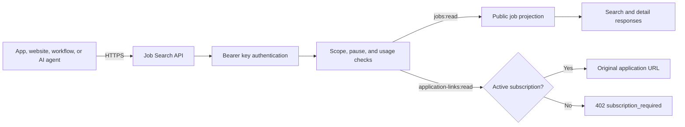
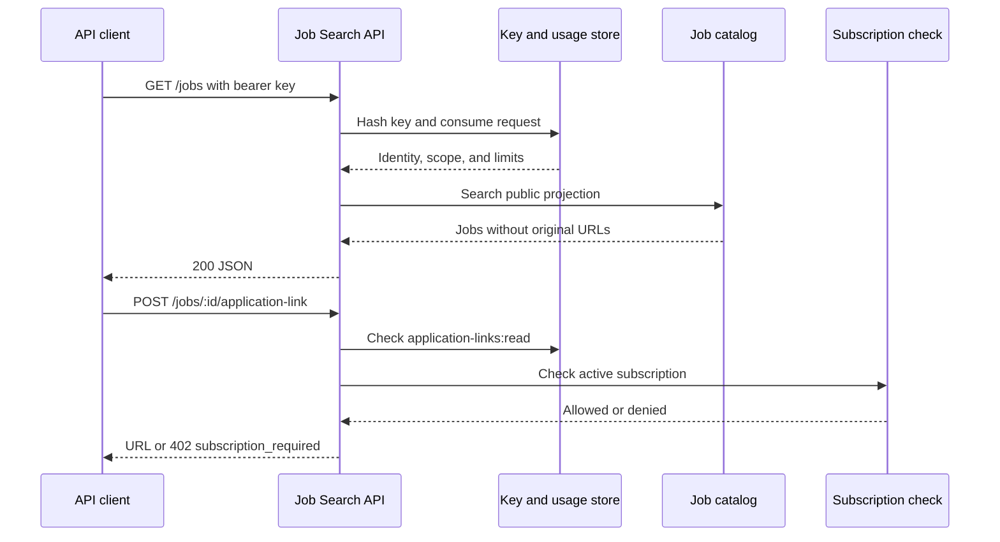

# Architecture

The API is a small REST boundary around a private job catalog and access-control layer.

## Request lifecycle

## Public projection

The API maps the internal job row into a deliberate public shape. Search and detail responses contain:

- Identity, slug, title, description, and description preview
- Company, location, category, employment type, and job type
- Salary, experience level, skills, and remote-location metadata
- Creation and update timestamps
- `hasApplicationLink` as a boolean capability indicator

They do not contain `url`, `application_url`, or `source_url`. The application link is read through a separate endpoint, checked on every request, and returned with `Cache-Control: no-store, private`.

## Runtime components

| Component | Responsibility |
| --- | --- |
| `api-v1/index.ts` | HTTP routing, authentication outcomes, response headers, and status codes |
| `_shared/api-keys.ts` | Bearer extraction, SHA-256 hashing, and scope definitions |
| `_shared/jobs-api.ts` | Search normalization, data access, and public job mapping |
| `_shared/openapi.ts` | Runtime OpenAPI 3.1 document |
| `_shared/cors.ts` | Browser-compatible response headers |

The function uses a Supabase service-role client only inside the server runtime. It is never returned to a caller or placed in a client-side configuration.

## Boundary of this repository

This repository contains the adapter and its public contract. It intentionally does not contain:

- Job records or customer data
- Service-role credentials or API keys
- Private billing credentials
- Original application destinations
- The frontend dashboard or private ingestion workflows

See [`backend-contract.md`](backend-contract.md) for the minimum data-layer interface required by a self-hosted deployment.
